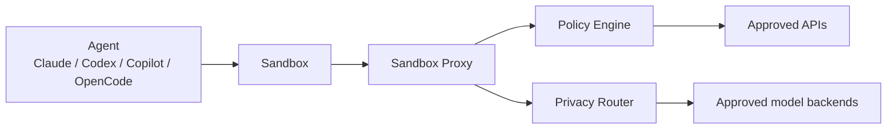

# NVIDIA OpenShell

### The sandbox AI agents should have had from day one

---

## Why this matters now

Modern agents can already:

- read your repo
- run shell commands
- install packages
- call external APIs
- carry credentials
- keep working long after you stop watching

Great for productivity.

Terrifying for blast radius.

---

## The core tension

For long-running agents, you usually want all three:

1. **Capability**
2. **Autonomy**
3. **Safety**

Most setups let you have only **two**.

If the agent is useful and autonomous, but unconstrained, you are trusting a very confident shell script with your secrets.

---

## OpenShell in one sentence

**OpenShell is an open-source runtime that lets agents run in isolated sandboxes governed by declarative YAML policies — enforcing control over files, network access, processes, and inference routing.**

The big design move:

- put guardrails **outside** the agent
- make them **kernel- and runtime-enforced**
- keep policies **reviewable, versionable, and hot-reloadable**

Think:

> the browser tab model, but for agents

---

## What sits in the middle



Core components:

- **Gateway** — control-plane API, auth boundary
- **Sandbox** — isolated container with policy-enforced egress
- **Policy Engine** — filesystem, network, and process constraints
- **Privacy Router** — strips caller creds, routes to managed models

---

## Why this is more than container theater

OpenShell combines:

- **Landlock** for filesystem restrictions
- **seccomp** for dangerous syscall filtering
- **unprivileged identities** for agent processes
- **minimal outbound access** by default
- **L7 REST method/path rules** for selected endpoints
- **explicit deny rules** to block specific endpoints

It is not just:

> "please behave nicely, dear agent"

---

## The policy model is the clever bit

Static at sandbox creation:

- `filesystem_policy`
- `landlock`
- `process`

Hot-reloadable while running:

- `network_policies` — allow **and** deny rules
- `inference` — reroute model API calls on the fly

That means:

- disk boundaries stay stable
- network permissions can evolve as the agent hits denials
- inference routing can switch backends without restart
- policy becomes a real workflow, not a one-time guess

---

## Providers — credential management done right

Agents need keys. OpenShell manages them as **providers**:

- named credential bundles injected at sandbox creation
- auto-discovered from your shell environment
- **never** written to the sandbox filesystem
- injected as env vars at runtime only

```bash
# auto-discovers ANTHROPIC_API_KEY from your env
openshell sandbox create -- claude

# explicit provider creation
openshell provider create --type claude --from-existing
```

No more `.env` files floating around inside containers.

---

## What ships today (v0.0.30)

Agents in the base image:

- Claude Code, Codex, GitHub Copilot CLI, OpenCode

Community sandboxes (`--from`):

- OpenClaw, Ollama, or **bring your own container**

Install:

```bash
curl -LsSf https://raw.githubusercontent.com/NVIDIA/OpenShell/main/install.sh | sh
# or: uv tool install openshell
```

Extras:

- **Terminal UI** (`openshell term`) — k9s-style live dashboard
- **GPU passthrough** — experimental
- **MicroVM runtime** (`openshell-vm`) — experimental libkrun alternative to Docker

---

## Reality check

Still blunt:

- **alpha software** — v0.0.30, rapid daily releases
- effectively **single-player mode** today
- the control plane is **K3s inside a single Docker container**

What has improved:

- **macOS** (Apple Silicon) is now supported
- **external security audit** completed, findings remediated
- **OCSF structured logging** for sandbox events
- Windows via WSL 2 + Docker Desktop remains **experimental**

This is real infrastructure, shipping fast.

---

## Why I think it matters

The interesting story is **not**:

> NVIDIA made another AI thing.

The interesting story is:

> somebody is building the control plane for autonomous agents — and they are building it with agents.

The `.agents/skills/` directory powers the project's own dev cycle: spike → approve → build → review.

If agents are going to touch real systems, the missing piece is not more swagger.

It is a trustworthy runtime boundary.

---

## Sources

- [docs.nvidia.com/openshell/latest/](https://docs.nvidia.com/openshell/latest/)
- [github.com/NVIDIA/OpenShell](https://github.com/NVIDIA/OpenShell)
- [Brev Launchable — try it without local setup](https://brev.nvidia.com/launchable/deploy/now?launchableID=env-3Ap3tL55zq4a8kew1AuW0FpSLsg)
