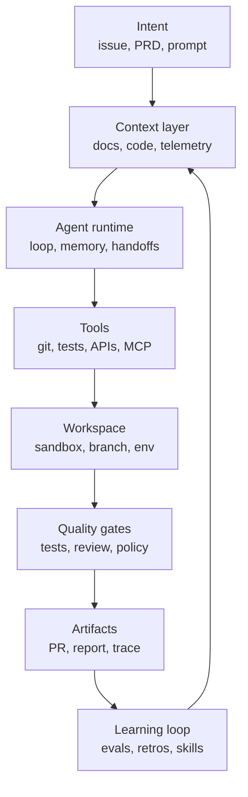
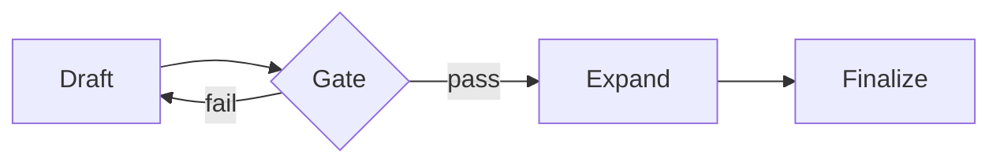
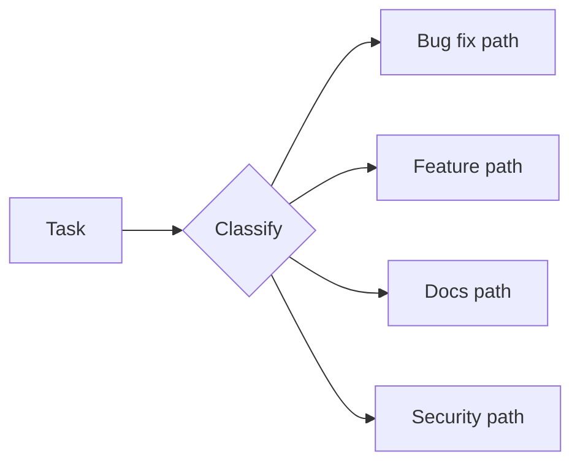
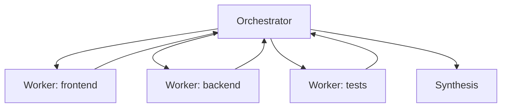
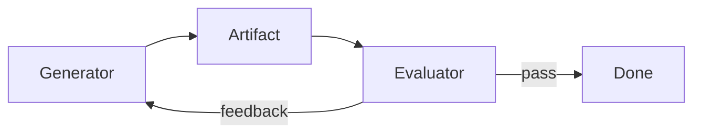
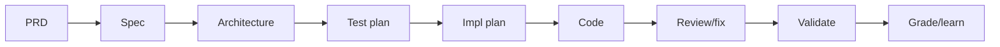
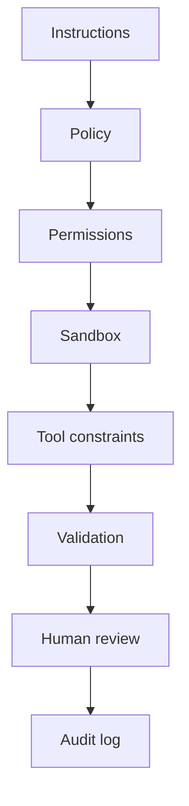
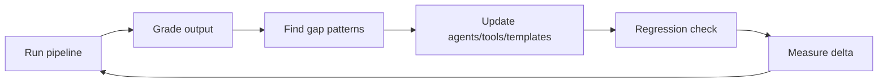

# Agentic Engineering

### Building software with agents, not just prompts

40-45 minutes

Note:
Opening framing: this is not a "how to prompt better" talk.
It is about how software engineering changes when AI systems can plan,
use tools, edit code, run tests, and keep working across multiple steps.

---

## The claim

**Agentic engineering is the discipline of designing the system around the agent.**

Not:

- "let the model do whatever"
- "vibe until it works"
- "replace engineers with bots"

But:

- goals
- context
- tools
- guardrails
- verification
- handoffs
- learning loops

Note:
This is the thesis. Keep it crisp. The engineer's leverage moves from
typing every implementation detail to designing the workflow where an agent can
make progress safely and observably.

---

## Why this matters now

Coding agents can already:

- inspect repositories
- edit multiple files
- run builds and tests
- open branches and pull requests
- use issue trackers, docs, telemetry, and browsers
- continue work in local, IDE, CLI, and cloud environments

The bottleneck is shifting from **model capability** to **engineering discipline**.

Note:
Reference the public product trend without turning this into vendor marketing:
Claude Code, Copilot cloud agent, Codex CLI/Web, Cursor-style agent modes,
OpenAI Agents SDK, LangGraph, AutoGen, CrewAI, smolagents, etc.

---

## The new failure mode

When a normal script fails, it usually fails where you wrote it.

When an agent fails, it may fail because:

- it had the wrong context
- the tool interface was ambiguous
- it optimized the wrong success criterion
- it silently skipped verification
- one worker made a decision another worker never saw
- the human approved a plausible artifact, not a proven result

Note:
This slide motivates why "just use agents" is not enough. The hard part is
operationalizing them.

---

## Research snapshot: April 2026

The public landscape has converged around five ideas:

1. coding agents are moving from IDE assistants to local and cloud workers
2. MCP is becoming the common tool/context connector
3. A2A is emerging for agent-to-agent interoperability
4. skills and custom agents are becoming the packaging layer for team knowledge
5. reliable systems emphasize context, verification, traces, and sandboxes over agent swarms

Note:
This slide explicitly anchors the talk in the current online research. It avoids
deep vendor specifics, but names the patterns that are now visible across public
docs and frameworks.

---

## Agenda

1. What changed
2. From prompting to context engineering
3. The agentic engineering stack
4. Workflow patterns that actually work
5. Quality gates, safety, and observability
6. How teams should adopt this

Note:
Set expectations: conceptual, practical, and current as of 2026.

---

## Part 1

# What changed

---

## Before: AI-assisted coding

The old mental model:

```text
human writes code
AI suggests snippets
human accepts / edits / rejects
```

Useful, but local:

- one developer
- one editor
- one prompt
- one file or small change

Note:
This is Copilot autocomplete / chat-era thinking. Still valuable, but not the
same thing as agentic work.

---

## Now: agentic coding

The new mental model:

```text
human defines intent
agent explores
agent plans
agent edits
agent validates
human reviews decisions and evidence
```

The output is not just code.

It is a **trace of decisions**.

Note:
Emphasize trace. A trustworthy agentic workflow creates artifacts you can audit:
plan, changed files, test output, review comments, telemetry checks.

---

## A quick vocabulary reset

| Term | Useful definition |
| --- | --- |
| LLM call | One model response |
| Workflow | Fixed path of model/tool steps |
| Agent | Model dynamically chooses steps and tools |
| Multi-agent | Multiple specialized agents coordinate |
| Runtime | Where state, tools, permissions, traces, and execution live |

Note:
Anthropic's public framing is useful: workflows are predefined code paths;
agents dynamically direct their process. Most production systems are hybrids.

---

## Vibe coding vs agentic engineering

| | Vibe coding | Agentic engineering |
| --- | --- | --- |
| Input | prompt | spec + constraints |
| Context | ad hoc | engineered |
| Validation | "looks right" | tests, reviews, telemetry |
| Memory | chat history | artifacts and traces |
| Failure handling | reprompt | diagnose loop |
| Human role | accept output | own decisions |

Note:
Do not dunk on vibe coding too much. It is great for prototypes. The point is
that production engineering needs stronger machinery.

---

## What the market converged on

Across current tools and frameworks, the primitives look familiar:

- **agents** with instructions
- **tools** with schemas
- **handoffs** or delegation
- **guardrails**
- **sessions / memory**
- **sandboxed workspaces**
- **tracing and evals**
- **human-in-the-loop checkpoints**

Different names, same shape.

Note:
This matches OpenAI Agents SDK, Claude Code, Copilot cloud agent customization,
LangGraph, AutoGen, CrewAI, smolagents, LlamaIndex workflows.

---

## The 2026 reality check

Agents are good at:

- bounded coding tasks
- repo exploration
- test-driven bug fixes
- mechanical refactors
- docs and migrations
- review passes with clear criteria

Agents still struggle with:

- vague product judgment
- hidden business context
- long-horizon consistency
- cross-system side effects
- incomplete feedback loops
- ambiguous ownership

Note:
This sets realistic expectations. Agents are a strong engineering multiplier,
not an excuse to stop engineering.

---

## Part 2

# Context engineering

---

## Prompt engineering was the warm-up

Prompt engineering:

```text
How do I phrase this request?
```

Context engineering:

```text
What does the agent need to know, when, in what form,
with what tools, and with what feedback?
```

The prompt is just one packet in a larger system.

Note:
This is one of the most important conceptual shifts. Make it memorable.

---

## Context is a budget

Every agent run spends context on:

- instructions
- conversation history
- files
- command output
- search results
- tool schemas
- test logs
- prior decisions

As context fills, quality often drops.

So the question is not "can I add more context?"

It is "what context earns its place?"

Note:
Claude Code best-practices publicly emphasizes context-window management.
This is increasingly a core engineering responsibility.

---

## Good context has structure

Prefer artifacts over chat sludge:

| Need | Better artifact |
| --- | --- |
| product intent | PRD / issue brief |
| technical target | spec |
| architecture | design doc / diagrams |
| implementation | file-level plan |
| validation | test matrix |
| rollout | flight / telemetry plan |
| learning | retrospective / rubric |

Note:
This is inspired by mature internal pipelines in industry, but keep it generic.
The point is that the agent should consume explicit artifacts, not infer everything
from a conversation.

---

## Context needs provenance

Agents should distinguish:

- user requirement
- codebase fact
- inferred assumption
- external documentation
- test result
- model opinion

Those are not the same kind of truth.

Note:
This is a good place to mention hallucination reduction without using the word too
often. Provenance prevents "source laundering" where a guess becomes a requirement.

---

## The context contract

For every serious agent task, define:

```text
goal:
  what outcome matters?

constraints:
  what must not change?

grounding:
  what sources are authoritative?

done:
  what evidence proves completion?

escalation:
  when should the agent stop and ask?
```

Note:
This is a reusable pattern. It can live in issue templates, agent instructions,
skills, or custom agent profiles.

---

## Context anti-patterns

- giant instruction files nobody curates
- dumping entire repositories into context
- stale architecture notes
- vague "follow best practices" rules
- hidden requirements in human memory
- asking multiple workers to decide independently
- losing the reason behind a change

Note:
The "giant instruction file" warning is practical. Claude and Copilot docs both
push toward concise persistent instructions plus skills/custom agents for repeatable
workflows.

---

## Part 3

# The agentic engineering stack

---

## Stack overview



Note:
This diagram is the backbone of the talk. You can refer back to it during the rest.

---

## Layer 1: intent

Weak intent:

```text
make onboarding better
```

Strong intent:

```text
reduce failed first-run setup for Windows users by detecting
missing Git earlier, showing the exact install command, and
covering this with CLI integration tests
```

Agents do not remove the need for product clarity.

They punish the lack of it faster.

Note:
Use a concrete example. Agents can implement, but the definition of value still
comes from humans.

---

## Layer 2: tools

A model sees tools through their interface.

Good tools are:

- small
- typed
- well documented
- hard to misuse
- explicit about side effects
- noisy when they fail
- cheap to call when possible

Tool design is UX design for models.

Note:
Anthropic's SWE-bench writeup makes this point strongly: tool descriptions and
error-proofing matter a lot.

---

## Tool interface example

Bad:

```text
run(command: string)
```

Better:

```text
run_test(
  suite: "unit" | "integration",
  target?: string,
  timeout_seconds: number
)
```

Best depends on the job.

Power is useful. Ambiguity is expensive.

Note:
Do not imply every shell tool should be replaced. The point is that for repeated
high-stakes operations, structured tools reduce failure.

---

## Layer 3: workspace

Agents need room to act.

They also need boundaries:

- branch or worktree isolation
- sandboxed filesystem
- controlled network access
- scoped credentials
- reproducible dependencies
- clear cleanup rules

Autonomy without isolation is just a fast blast radius.

Note:
Tie this to cloud agents using ephemeral environments, local CLI permission modes,
Docker/sandbox patterns, and security posture.

---

## Layer 4: runtime

The runtime answers:

- who owns the loop?
- where does state live?
- how are tools called?
- how are interruptions handled?
- can work resume after failure?
- where is the trace?
- where do humans approve?

Agents are not just prompts.

They are long-running programs with probabilistic components.

Note:
This connects to LangGraph durable execution, OpenAI sessions/tracing,
AutoGen runtimes, Copilot cloud agent logs, etc.

---

## Layer 5: protocols

Two standards matter right now:

| Protocol | Job |
| --- | --- |
| MCP | connect agents to tools, data, and workflows |
| A2A | let agents discover and collaborate with other agents |

Oversimplified:

```text
MCP = agent -> tool/context
A2A = agent -> agent
```

Note:
Use careful language. MCP is widely adopted across clients and servers. A2A is
newer and focused on interoperability between opaque agentic applications.

---

## MCP in one slide

MCP is an open standard for connecting AI apps to external systems:

- files
- databases
- issue trackers
- browsers
- design tools
- internal services
- prompts and workflows

The value is not novelty.

The value is **one connector shape across many agents**.

Note:
Reference the "USB-C for AI applications" analogy if useful, but do not overuse it.

---

## A2A in one slide

A2A is an open protocol for agent-to-agent collaboration:

- capability discovery via agent cards
- JSON-RPC over HTTP(S)
- sync, streaming, and async task updates
- task lifecycle and artifacts
- modality negotiation
- collaboration without exposing internal memory or tools

This matters when teams stop having one agent
and start having an ecosystem.

Note:
Mention that A2A complements MCP: MCP exposes tools/context; A2A connects
agentic applications.

---

## Part 4

# Workflow patterns

---

## Start simple

The best public guidance is surprisingly consistent:

> Use the simplest system that meets the reliability target.

Often that means:

1. one strong model call
2. retrieval or examples
3. tool use
4. fixed workflow
5. agent loop
6. multi-agent system

In that order.

Note:
Anthropic's "Building effective agents" says not to add complexity until it
demonstrably improves outcomes. This is a practical architecture principle.

---

## Pattern: prompt chain



Use when:

- steps are known
- each step has clear inputs and outputs
- intermediate checks improve quality

Example:

```text
issue -> spec -> review -> implementation plan
```

Note:
This is a workflow, not a fully autonomous agent. Workflows are underrated.

---

## Pattern: routing



Use when:

- tasks have distinct classes
- each class needs different tools or standards
- routing can be tested

Note:
Route routine tasks to cheaper/faster models or specialized agents; route risky
tasks to stricter review.

---

## Pattern: orchestrator-workers



Use when:

- subtasks cannot be predicted upfront
- exploration can be parallelized
- synthesis is explicit

Danger:

- workers make conflicting hidden decisions

Note:
This is powerful but risky. Make the orchestrator own decisions; workers should
return evidence and options, not silently commit architecture.

---

## Pattern: evaluator-optimizer



Use when:

- quality criteria are clear
- feedback improves output
- loop cost is acceptable

Coding version:

```text
implement -> test -> review -> fix -> test -> review
```

Note:
This is the core loop behind serious coding agents. The evaluator can be tests,
linters, another model, static analysis, human review, or telemetry.

---

## Pattern: pipeline



This is agentic engineering at team scale:

- each stage creates an artifact
- each artifact has a gate
- humans own decisions
- learnings update the system

Note:
This is where the private repo inspiration is abstracted: a multi-stage pipeline
from idea to shipped code with quality gates and self-improvement.

---

## A good pipeline artifact

It should answer:

- what changed?
- why this approach?
- what alternatives were rejected?
- what files or systems are touched?
- what risks remain?
- what evidence was collected?
- what should a human decide?

If an artifact cannot be reviewed,
it is not an engineering artifact.

Note:
This applies to specs, plans, code reviews, testing outputs, and rollouts.

---

## Where multi-agent goes wrong

```text
Task
  -> Agent A makes assumption X
  -> Agent B makes assumption not-X
  -> Agent C tries to merge both
```

The bug is not "the models are dumb."

The bug is **distributed unshared context**.

Note:
This reflects Cognition's context-engineering critique. Actions carry implicit
decisions. If decisions are not shared, outputs diverge.

---

## Safer multi-agent rules

Use multiple agents for:

- independent research
- review from different perspectives
- generating options
- bounded specialist tasks
- high-volume triage

Be careful using multiple agents for:

- concurrent code edits
- architecture decisions
- product scope decisions
- anything with shared mutable state

Note:
This is a practical adoption rule. Parallelism is valuable, but coordination costs
are real.

---

## Part 5

# Quality, safety, observability

---

## Give the agent a verifier

Weak:

```text
fix the bug
```

Strong:

```text
write a failing test that reproduces the bug,
fix the root cause, run the targeted test,
then run the package test suite
```

Agents get much better when they can check their own work.

Note:
Public Claude Code best practices explicitly recommend giving agents verification
criteria: tests, screenshots, builds, commands, etc.

---

## Quality gates

Useful gates:

- spec completeness
- architecture review
- threat model
- test coverage matrix
- lint/typecheck/build
- code review
- security scan
- rollout metrics
- retrospective score

The gate should block or escalate.

A gate that only produces vibes is decoration.

Note:
Make sure "gate" means decision, not just an artifact.

---

## Human-in-the-loop is not one thing

| Mode | Human does |
| --- | --- |
| approve | yes/no checkpoint |
| choose | select among options |
| edit | modify artifact |
| inspect | review trace/evidence |
| intervene | redirect live run |
| own | make product/security decision |

Good systems are explicit about which mode applies.

Note:
This avoids the vague phrase "human in the loop". A human rubber-stamping a giant
diff is not meaningful oversight.

---

## Safety is layered



Instructions are not enough.

Put guardrails outside the model too.

Note:
This aligns with sandboxing, permission allowlists, MCP server scopes, branch
isolation, and deterministic hooks.

---

## Observability for agents

You want to know:

- what did it read?
- what did it decide?
- which tools did it call?
- what failed?
- what was retried?
- how much did it cost?
- where did humans intervene?
- which outputs shipped?
- did the result improve metrics?

No trace, no trust.

Note:
Frame traces as both debugging and governance. Agentic systems need run logs like
distributed systems need logs.

---

## Evals: the missing CI job

Traditional CI asks:

```text
does this code still work?
```

Agent evals ask:

```text
does this agent workflow still produce good work?
```

Evaluate:

- task success
- correctness
- cost
- latency
- tool misuse
- review findings
- regression patterns

Note:
Use SWE-bench as a public example of evaluating an agent system, not only a model.
Internal evals can be much smaller and domain-specific.

---

## A useful grading rubric

Score each run on:

| Dimension | Question |
| --- | --- |
| accuracy | did it solve the right problem? |
| completeness | did it cover required cases? |
| evidence | did it verify claims? |
| maintainability | would we want this code? |
| acceleration | did it save real effort? |
| safety | did it stay inside boundaries? |

Then fix the pipeline, not just the one output.

Note:
This is the "self-improvement loop" idea. Grade, find systematic gaps, update
instructions/tools/skills/templates, and measure again.

---

## The self-improvement loop



Common gap patterns:

- fabricated paths
- missing tests
- scope drift
- shallow review
- stale docs
- ungrounded assumptions

Note:
Emphasize system learning. Teams should treat agent instructions and skills as
production assets, not prompt scraps.

---

## Part 6

# Adoption playbook

---

## Start with the right tasks

Good first tasks:

- documentation updates
- test generation for known behavior
- small bug fixes with repro steps
- mechanical migrations
- dependency update PRs
- codebase explanation
- issue triage
- review checklists

Bad first tasks:

- ambiguous product strategy
- risky auth changes
- broad rewrites
- multi-repo releases
- compliance-sensitive automation

Note:
Agentic engineering maturity starts with task selection.

---

## Build a task intake template

```yaml
goal: ...
non_goals: ...
authoritative_sources:
  - issue
  - spec
  - file paths
constraints:
  - do not change public API
  - keep backwards compatibility
validation:
  - command to run
  - expected result
human_checkpoints:
  - before code
  - before PR
```

Note:
This is easy to adopt tomorrow. Put it in issue templates or agent skills.

---

## Create specialized agents carefully

Good specialized agents have:

- narrow purpose
- clear trigger
- explicit tools
- domain rules
- output format
- escalation criteria
- examples of good and bad output

Bad specialized agents are just job titles:

```text
You are a 10x principal engineer...
```

Note:
Tie to custom agents in Copilot/Claude and open Agent Skills. Specificity beats
persona inflation.

---

## Skills beat giant memories

Use persistent instructions for:

- repo commands
- style rules
- workflow etiquette
- non-obvious gotchas

Use skills for:

- repeatable procedures
- domain playbooks
- templates
- scripts
- examples

Load the right knowledge at the right time.

Note:
This is current across Claude Code and Copilot agent skills. It also helps with
context budget.

---

## The engineer's new job

Less time:

- typing boilerplate
- searching by hand
- making routine edits
- writing first drafts

More time:

- defining intent
- designing context
- shaping tools
- setting gates
- reviewing evidence
- making trade-offs
- improving the system

Note:
This is optimistic but grounded. Engineering judgment becomes more important,
not less.

---

## Team operating model

Treat agents like junior teammates with superpowers:

- onboard them with concise docs
- give them scoped tasks
- require evidence
- review their work
- improve their environment
- do not let them silently own product decisions

The difference:

They can run 20 times a day.

So your process flaws scale too.

Note:
Good line: agents scale both good process and bad process.

---

## Anti-pattern checklist

Stop and redesign if:

- nobody can explain why the agent changed something
- humans approve without reading evidence
- tests are optional
- instructions conflict
- tool errors are ignored
- agents write to shared state concurrently
- failures are fixed by adding more prompt text
- there is no owner for agent behavior

Note:
This is intended as a take-home checklist.

---

## What to measure

Do not measure only:

```text
lines generated
```

Measure:

- cycle time to reviewed PR
- defect rate after merge
- review iterations
- test coverage changes
- escaped incidents
- human interruption rate
- cost per accepted change
- percent of tasks with reproducible evidence

Note:
If you only measure volume, you will optimize for garbage volume.

---

## The adoption ladder

```text
Level 0: autocomplete
Level 1: chat-assisted tasks
Level 2: local agent mode
Level 3: repeatable skills and custom agents
Level 4: gated team workflows
Level 5: closed-loop engineering pipeline
```

Most teams should aim for Level 3-4 before dreaming about Level 5.

Note:
This helps organizations locate themselves without hype.

---

## A practical first month

Week 1:

- pick 3 task types
- write intake template
- document build/test commands

Week 2:

- create one skill or custom agent
- add verification rules
- capture traces and outcomes

Week 3:

- add review rubric
- measure accepted vs rejected work

Week 4:

- update instructions based on failures
- expand only if quality improves

Note:
No dates in the plan, just sequence. This makes the talk actionable.

---

## What not to outsource

Keep humans accountable for:

- product strategy
- user empathy
- security posture
- architecture trade-offs
- irreversible operations
- legal/compliance decisions
- incident command
- final ownership of shipped code

Agents can provide options and evidence.

They should not become the accountability sink.

Note:
This is important for audience trust.

---

## The future shape

Expect more:

- cloud agents working asynchronously
- local agents with stronger sandboxing
- shared skill ecosystems
- MCP servers as internal platform APIs
- A2A-style agent marketplaces
- evals as part of CI/CD
- agent traces in PR review
- engineering managers reviewing throughput and quality by agent workflow

Note:
Make this future-facing but not sci-fi.

---

## The core lesson

Agentic engineering is not about trusting agents more.

It is about building systems where agents can be useful **without requiring blind trust**.

That means:

- grounded context
- constrained tools
- observable traces
- explicit gates
- human ownership
- continuous improvement

Note:
This is the closing thesis. Pause after this.

---

## Takeaways

1. Agents are software systems, not magic prompts.
2. Context engineering is the main leverage point.
3. Workflows beat autonomy until autonomy is needed.
4. Multi-agent systems need shared decisions, not just parallel workers.
5. Verification is the difference between demo and production.
6. The best teams will improve the pipeline, not just the prompt.

Note:
End with concrete takeaways.

---

## Sources and further reading

- [Anthropic: Building Effective Agents](https://www.anthropic.com/engineering/building-effective-agents)
- [Anthropic: Claude Code Best Practices](https://www.anthropic.com/engineering/claude-code-best-practices)
- [OpenAI Agents SDK](https://openai.github.io/openai-agents-python/)
- [OpenAI: A Practical Guide to Building Agents](https://cdn.openai.com/business-guides-and-resources/a-practical-guide-to-building-agents.pdf)
- [GitHub Docs: Copilot cloud agent](https://docs.github.com/en/copilot/using-github-copilot/coding-agent/about-assigning-tasks-to-copilot)
- [GitHub Docs: custom agents and agent skills](https://docs.github.com/en/copilot/concepts/agents/about-agent-skills)
- [Model Context Protocol](https://modelcontextprotocol.io/introduction)
- [Agent2Agent Protocol](https://github.com/a2aproject/A2A)
- [LangGraph](https://docs.langchain.com/oss/python/langgraph/overview), [AutoGen](https://microsoft.github.io/autogen/stable/index.html), [CrewAI](https://docs.crewai.com/introduction), [smolagents](https://huggingface.co/docs/smolagents/en/index)
- [Cognition: Principles of Context Engineering](https://cognition.ai/blog/dont-build-multi-agents)
- [SWE-bench / SWE-bench Verified](https://www.swebench.com/)

Note:
These are public sources used to calibrate the talk. The talk intentionally avoids
referencing private systems directly.

---

## Q&A

# What would you let an agent ship?

Note:
Use this as discussion prompt. Ask the audience to think about a task they would
delegate tomorrow and what evidence they would require before accepting it.
