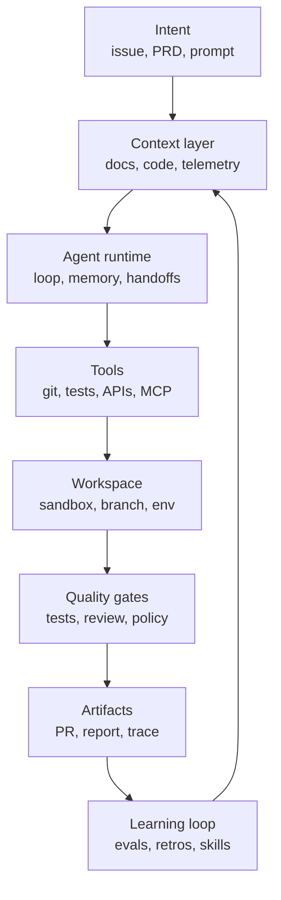
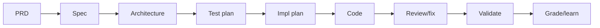
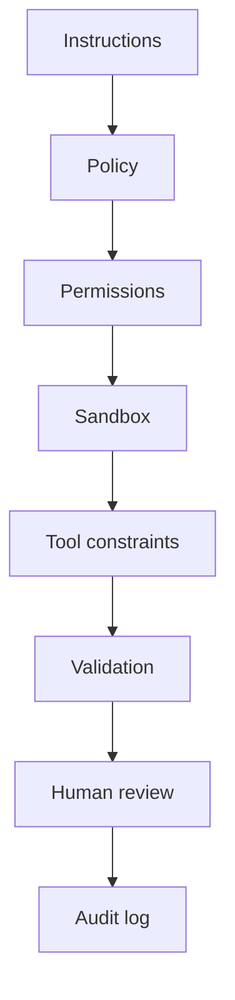
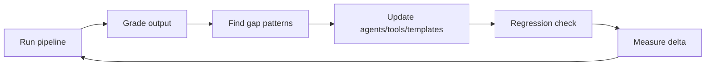

# Agentic Engineering

### Building software with agents, not just prompts

**David Kaya** · Senior Software Engineer at Microsoft

Note:
Hi, I am David Kaya, and today I want to talk about agentic engineering.

This is not a talk about writing better prompts. Prompting is part of the story,
but it is the smallest part. The bigger shift is that AI systems can now inspect
repositories, make plans, edit code, run commands, and come back with evidence.

So the question changes. It is no longer only "how do I ask the model nicely?"
It is "how do we design engineering systems where agents can do useful work
without creating chaos?"

That is what I mean by agentic engineering.

---

## The claim

**Agentic engineering is the discipline of designing the system around the agent.**

Not:

- "let the model do whatever"
- "vibe until it works"
- "replace engineers with bots"

But:

- goals
- context
- tools
- guardrails
- verification
- handoffs
- learning loops

Note:
This is the central claim of the talk: agentic engineering is not about trusting
the model more. It is about designing the environment around the model better.

If we give an agent a vague goal, random context, dangerous tools, and no way to
check its work, we should not be surprised when the result is unreliable. That is
not a model problem only. That is a system design problem.

The engineer's job shifts from typing every implementation detail to designing a
workflow where an agent can make progress safely, where a human can understand
what happened, and where the team can improve the system over time.

---

## Why this matters now

Coding agents can already:

- inspect repositories and docs
- edit multiple files
- run builds and tests
- open branches and pull requests
- use issue trackers, browsers, telemetry, and MCP servers
- continue work in local, IDE, CLI, and cloud environments

The bottleneck is shifting from **model capability** to **engineering discipline**.

The 2026 pattern is clear: agents are becoming workers, MCP is the tool/context
connector, A2A is emerging for agent-to-agent interoperability, and reliable
systems emphasize context, verification, traces, and sandboxes over agent swarms.

Note:
This matters now because the product landscape changed very quickly. We are no
longer talking only about autocomplete or a chat window inside an editor.

Modern coding agents can explore a repository, change several files, run the
build, inspect failures, iterate, and sometimes create a pull request without a
human touching every step. They can run locally, in the IDE, in the terminal, or
as cloud workers.

At the same time, protocols such as MCP are standardizing how agents connect to
tools and context. A2A is emerging for agent-to-agent interoperability. Skills
and custom agents are becoming a way to package team knowledge.

So the bottleneck is less "can the model write code?" and more "can our
engineering process make that work reliable?"

---

## The new failure mode

When a normal script fails, it usually fails where you wrote it.

When an agent fails, it may fail because:

- it had the wrong context
- the tool interface was ambiguous
- it optimized the wrong success criterion
- it silently skipped verification
- one worker made a decision another worker never saw
- the human approved a plausible artifact, not a proven result

Note:
Agents introduce a different kind of failure. With a normal script, the behavior
is usually encoded in the script. If it fails, we look at the line of code, the
input, and the output.

With an agent, the failure may come from the context it saw, the tool description
it misunderstood, the success criterion it optimized for, or a hidden assumption
made earlier in the run.

This is why agentic engineering needs traces, gates, and explicit handoffs. If an
agent produces a plausible answer, that is not the same as a proven answer. The
human reviewer needs to see the evidence, not just the final diff.

---

## From assistant to agent

AI-assisted coding:

```text
human writes code
AI suggests snippets
human accepts / edits / rejects
```

Agentic coding:

```text
human defines intent
agent explores, plans, edits, validates
human reviews decisions and evidence
```

The output is not just code.

It is a **trace of decisions**.

Working definitions:

```text
workflow = fixed path of model/tool steps
agent    = model dynamically chooses steps and tools
runtime  = state, tools, permissions, traces, execution
```

Most production systems are hybrids.

Note:
The old mental model was AI-assisted coding: I write code, the AI suggests a
snippet, and I accept, edit, or reject it. That is still useful, but it is a
local interaction.

Agentic coding is different. The human defines intent. The agent explores the
codebase, makes a plan, edits files, runs validation, and returns not just code
but a trail of what it did.

For this talk, I use three working definitions. A workflow is a fixed path of
model and tool steps. An agent dynamically chooses steps and tools. A runtime is
the system that holds state, permissions, traces, and execution.

In practice, most serious systems are hybrids: some fixed workflow, some agentic
choice, and human checkpoints around important decisions.

---

## Vibe coding vs agentic engineering

| | Vibe coding | Agentic engineering |
| --- | --- | --- |
| Input | prompt | spec + constraints |
| Context | ad hoc | engineered |
| Validation | "looks right" | tests, reviews, telemetry |
| Memory | chat history | artifacts and traces |
| Failure handling | reprompt | diagnose loop |
| Human role | accept output | own decisions |

Note:
Vibe coding is useful. It is a great way to prototype, explore an idea, or get
unstuck. The problem is when we use the same style for production work.

In vibe coding, the input is often just a prompt. The context is whatever happens
to be in the chat. Validation is "does this look right?" If it fails, we reprompt.

Agentic engineering is stricter. The input is a spec plus constraints. Context is
curated. Validation is tests, reviews, telemetry, or some other evidence. Memory
lives in artifacts and traces, not only in a chat transcript.

Most importantly, the human role is not to rubber-stamp output. The human still
owns the decisions.

---

## The 2026 reality check

Agents are good at:

- bounded coding tasks
- repo exploration
- test-driven bug fixes
- mechanical refactors
- docs and migrations
- review passes with clear criteria

Agents still struggle with:

- vague product judgment
- hidden business context
- long-horizon consistency
- cross-system side effects
- ambiguous ownership

Note:
This is the reality check. Agents are already useful, but they are not equally
useful for every kind of work.

They are strong when the task is bounded, the repository can be inspected, the
expected behavior can be tested, and the output can be reviewed. That makes them
good at bug fixes with repro steps, mechanical refactors, documentation updates,
migrations, and review passes with clear criteria.

They struggle when the hard part is hidden business context, product judgment,
ambiguous ownership, or side effects across systems. If the team cannot explain
the goal clearly to another human, the agent will not magically infer it.

So the adoption strategy should start where agents are strong.

---

## Context engineering

Prompt engineering:

```text
How do I phrase this request?
```

Context engineering:

```text
What does the agent need to know, when, in what form,
with what tools, and with what feedback?
```

The prompt is just one packet in a larger system.

Note:
The phrase "prompt engineering" made sense when the main interaction was one
prompt and one response. But with agents, the prompt is only one packet in a much
larger system.

Context engineering asks a broader question: what should the agent know, when
should it know it, how should that information be structured, what tools should
it have, and what feedback should it receive?

This is where a lot of leverage is. A mediocre prompt with excellent grounding,
clear constraints, and a verifier can outperform a clever prompt with chaotic
context.

So if there is one concept to take away early, it is this: context is now an
engineering surface.

---

## The context contract

For every serious agent task, define:

```text
goal:
  what outcome matters?
constraints:
  what must not change?
grounding:
  what sources are authoritative?
done:
  what evidence proves completion?
escalation:
  when should the agent stop and ask?
```

Note:
This is a practical pattern: before giving an agent a serious task, define a
context contract.

The goal says what outcome matters. The constraints say what must not change.
Grounding says which sources are authoritative: maybe the issue, a design doc, a
specific API contract, or particular files. Done says what evidence proves
completion. Escalation says when the agent should stop and ask instead of
guessing.

This contract can live in issue templates, agent instructions, a skill, or a
custom agent profile. It does not need to be heavy. Even a short version makes
the work much safer because it prevents the agent from inventing the rules as it
goes.

---

## Good context has structure

Prefer artifacts over chat sludge:

| Need | Better artifact |
| --- | --- |
| product intent | PRD / issue brief |
| technical target | spec |
| architecture | design doc / diagram |
| implementation | file-level plan |
| validation | test matrix |
| learning | retrospective / rubric |

Also preserve provenance:

```text
requirement != codebase fact != assumption != model opinion
```

Note:
Good context is not just more context. Good context has structure.

Instead of a long chat where requirements, guesses, code facts, and opinions are
mixed together, create artifacts. A product intent belongs in an issue brief or a
PRD. Architecture belongs in a design doc or diagram. Validation belongs in a
test matrix. Learnings belong in a retrospective or rubric.

The second part is provenance. A user requirement is not the same as a codebase
fact. A codebase fact is not the same as an inferred assumption. A model opinion
is not the same as external documentation.

When those are mixed together, guesses can become requirements by accident.
Structured context prevents that.

---

## Context anti-patterns

- giant instruction files nobody curates
- dumping entire repositories into context
- stale architecture notes
- vague "follow best practices" rules
- hidden requirements in human memory
- asking multiple workers to decide independently
- losing the reason behind a change

As context fills, quality often drops.

So ask: **what context earns its place?**

Note:
There are also context anti-patterns.

One is the giant instruction file that nobody curates. It feels responsible, but
over time it becomes a landfill of old rules, duplicated guidance, and conflicts.

Another is dumping too much into context. More tokens do not automatically mean
more quality. As context fills, the model has to pay attention to more material,
and important facts can become diluted.

The right question is not "can I add this to context?" The right question is
"does this context earn its place?" If it is stale, vague, duplicated, or not
authoritative, it may make the system worse.

---

## The agentic engineering stack



Note:
This diagram is the backbone of the talk.

Start with intent: what are we trying to achieve? That flows into the context
layer: documents, code, telemetry, examples, and constraints. The agent runtime
then uses tools: git, tests, APIs, browsers, MCP servers, and so on.

But the agent also needs a workspace: a branch, worktree, sandbox, or environment
where it can act without damaging shared state. After that come gates: tests,
review, policy, and security checks. The output is an artifact: a pull request,
report, trace, or decision log.

Finally, the learning loop feeds back into the system. If the agent repeatedly
misses tests, we do not just complain. We update the workflow.

---

## Layer: intent

Weak intent:

```text
make onboarding better
```

Strong intent:

```text
reduce failed first-run setup for Windows users by detecting
missing Git earlier, showing the exact install command, and
covering this with CLI integration tests
```

Agents do not remove the need for product clarity.

They punish the lack of it faster.

Note:
Intent is the first layer because agents amplify whatever intent we give them.

"Make onboarding better" sounds reasonable, but it is too vague. Better for whom?
What failure are we fixing? What behavior should change? What evidence proves the
work is done?

The stronger version names the user group, the failure mode, the expected product
behavior, and the validation. Now the agent has something concrete to optimize
for.

This is an important point: agents do not remove the need for product clarity.
They punish the lack of it faster. If the goal is vague, the agent can produce a
large amount of plausible work in the wrong direction.

---

## Layer: tools and protocols

A model sees tools through their interface.

Good tools are:

- small
- typed
- well documented
- hard to misuse
- explicit about side effects
- noisy when they fail

Two standards matter right now:

```text
MCP = agent -> tool/context
A2A = agent -> agent
```

Note:
The next layer is tools. A model does not experience a tool the way we do. It
sees the name, schema, description, inputs, outputs, and errors.

That means tool design is user experience design for models. Good tools are
small, typed, documented, hard to misuse, explicit about side effects, and noisy
when they fail. If a tool fails silently, the agent may continue with a false
belief.

Two standards are especially relevant now. MCP is the connector shape between an
agent and tools or context. A2A is about agent-to-agent collaboration. The short
version is: MCP connects agents to capabilities; A2A connects agentic systems to
each other.

---

## Layer: workspace and runtime

Agents need room to act.

They also need boundaries:

- branch or worktree isolation
- sandboxed filesystem
- controlled network access
- scoped credentials
- reproducible dependencies
- clear cleanup rules

The runtime answers:

- who owns the loop?
- where does state live?
- where is the trace?
- where do humans approve?

Note:
Agents need room to act. If every command requires a meeting, the agent is not
useful. But autonomy without boundaries is just a fast blast radius.

That is why workspace isolation matters: branches, worktrees, containers,
sandboxes, scoped credentials, and clear cleanup rules. The agent should be able
to make progress without writing into shared state or using credentials it does
not need.

The runtime is the system that owns the loop. It decides where state lives, how
tools are called, how work resumes after failure, where the trace is stored, and
where humans approve.

This is the part that turns "a model with a prompt" into an engineering system.

---

## Start simple

The best public guidance is surprisingly consistent:

> Use the simplest system that meets the reliability target.

Often that means:

1. one strong model call
2. retrieval or examples
3. tool use
4. fixed workflow
5. agent loop
6. multi-agent system

In that order.

Note:
This is one of the most practical pieces of guidance: start simple.

There is a temptation to jump directly to autonomous multi-agent systems because
they sound impressive. But many reliable systems are much simpler. Sometimes one
strong model call is enough. Sometimes you add retrieval or examples. Then tool
use. Then a fixed workflow. Only after that do you need a dynamic agent loop, and
only sometimes do you need multiple agents.

The rule is not "never use autonomy." The rule is "earn the complexity." Add more
agency only when it improves reliability, quality, or throughput enough to
justify the coordination cost.

---

## Workflow patterns that work

```text
prompt chain:
  draft -> gate -> expand -> finalize

routing:
  classify -> bug path | feature path | docs path

evaluator-optimizer:
  implement -> test -> review -> fix -> test
```

Use workflows when:

- steps are known
- quality criteria are clear
- intermediate checks improve output
- routing can be tested

Note:
Workflows are underrated because they are less glamorous than agents, but they
are often more reliable.

A prompt chain is useful when the steps are known: draft, check, expand, finalize.
Routing is useful when different task classes need different paths, like bug fix,
feature work, documentation, or security review. Evaluator-optimizer loops are
especially powerful in coding: implement, test, review, fix, and test again.

The key is that each step has a clear input and output. If you know the shape of
the work, a workflow gives you predictability. Save full autonomy for the parts
where the path really cannot be known upfront.

---

## The pipeline pattern



This is agentic engineering at team scale:

- each stage creates an artifact
- each artifact has a gate
- humans own decisions
- learnings update the system

Note:
At team scale, the useful pattern is often a pipeline.

You start with product intent, then a spec, then architecture, then a test plan,
then an implementation plan, then code, review, validation, and learning. The
point is not that every team needs exactly these stages. The point is that each
stage creates an artifact and each artifact can be reviewed.

This makes agentic work less magical and more auditable. The agent may help at
many stages, but humans own the important decisions. If the output is poor, the
team can ask which stage failed: was the intent unclear, the plan weak, the tests
missing, or the review shallow?

---

## Where multi-agent goes wrong

```text
Task
  -> Agent A makes assumption X
  -> Agent B makes assumption not-X
  -> Agent C tries to merge both
```

The bug is not "the models are dumb."

The bug is **distributed unshared context**.

Safer uses:

- independent research
- bounded specialist tasks
- review from different perspectives
- generating options

Note:
Multi-agent systems can be powerful, but they fail in predictable ways.

The common failure is distributed unshared context. Agent A makes one assumption,
Agent B makes the opposite assumption, and Agent C tries to merge the outputs. By
the time you see the result, the conflict is embedded in the work.

This is not just because the models are weak. It is because coordination is hard.
Every action carries implicit decisions. If those decisions are not shared, the
system diverges.

Safer uses are independent research, bounded specialist tasks, review from
different perspectives, and generating options. Be much more careful with
parallel code edits, architecture decisions, or shared mutable state.

---

## Give the agent a verifier

Weak:

```text
fix the bug
```

Strong:

```text
write a failing test that reproduces the bug,
fix the root cause, run the targeted test,
then run the package test suite
```

Agents get much better when they can check their own work.

Note:
One of the simplest improvements is to give the agent a verifier.

"Fix the bug" leaves too much open. The agent may make a change that looks right
but never proves the issue was reproduced or fixed.

The stronger instruction creates a loop. First write a failing test that captures
the bug. Then fix the root cause. Then run the targeted test. Then run the wider
suite. Now the agent has feedback, and the human reviewer has evidence.

This pattern applies beyond tests. A verifier can be a screenshot, a linter, a
typecheck, a security scan, telemetry, or a human review checklist. The point is:
do not ask only for output. Ask for evidence.

---

## Quality gates

Useful gates:

- spec completeness
- architecture / threat review
- test coverage matrix
- lint/typecheck/build
- code review
- security scan
- rollout metrics
- retrospective score

The gate should block or escalate.

A gate that only produces vibes is decoration.

Note:
Quality gates turn evidence into decisions.

A useful gate can be spec completeness, architecture review, threat modeling,
test coverage, lint, typecheck, build, code review, security scan, rollout
metrics, or a retrospective score.

But the gate needs teeth. It should either block the work, escalate to a human,
or explicitly record the risk. If a gate only produces a nice-looking artifact
that everybody ignores, it is decoration.

This is where agentic engineering starts to look like normal engineering again:
clear criteria, automated checks where possible, human judgment where necessary,
and explicit ownership of exceptions.

---

## Human-in-the-loop is not one thing

| Mode | Human does |
| --- | --- |
| approve | yes/no checkpoint |
| choose | select among options |
| edit | modify artifact |
| inspect | review trace/evidence |
| intervene | redirect live run |
| own | make product/security decision |

Good systems are explicit about which mode applies.

Note:
People often say "human in the loop" as if it means one thing. It does not.

Sometimes the human approves a yes or no checkpoint. Sometimes the human chooses
between options. Sometimes they edit an artifact. Sometimes they inspect a trace.
Sometimes they intervene during a live run. And sometimes they simply own a
decision that should not be delegated, like product scope or security posture.

These are different modes, and a good system is explicit about which one is
expected. A human rubber-stamping a giant diff is not meaningful oversight. A
human reviewing the key decisions and evidence is much more useful.

---

## Safety is layered



Instructions are not enough.

Put guardrails outside the model too.

Note:
Safety has to be layered. Instructions matter, but instructions are not enough.

If the only safety mechanism is "the prompt says not to do dangerous things,"
that is too weak. Add policy, permissions, sandboxing, tool constraints,
validation, human review, and audit logs.

For example, the agent might be allowed to read broadly but write only inside a
worktree. It might be allowed to run tests but not deploy. It might have scoped
credentials instead of production credentials. It might need approval before a
network call or a destructive operation.

The theme is simple: put guardrails outside the model, not only inside the
prompt.

---

## Observability for agents

You need a trace of:

- inputs read
- decisions made
- tools called
- failures, retries, and cost
- human interventions
- shipped outputs and metrics

No trace, no trust.

Note:
Observability is what makes agentic systems debuggable.

When an agent produces an output, you want to know what it read, what it decided,
which tools it called, what failed, what was retried, how much it cost, where a
human intervened, and whether the result actually improved anything after it
shipped.

This is similar to distributed systems. We would not run a serious distributed
system with no logs, no traces, and no metrics. Agentic systems need the same
mindset.

The short version is: no trace, no trust. If we cannot reconstruct what happened,
we cannot reliably improve the system.

---

## Evals: the missing CI job

Traditional CI asks:

```text
does this code still work?
```

Agent evals ask:

```text
does this agent workflow still produce good work?
```

Score runs on:

- accuracy
- completeness
- evidence
- maintainability
- acceleration
- safety

Track outcomes:

- cycle time to reviewed PR
- defect rate after merge
- review iterations
- human interruption rate
- cost per accepted change
- tasks with reproducible evidence

Then fix the pipeline, not just the one output.

Note:
Traditional CI asks whether the code still works. Agent evals ask a different
question: does this agent workflow still produce good work?

You can score runs on accuracy, completeness, evidence, maintainability,
acceleration, and safety. You can also track practical outcomes: cycle time to a
reviewed pull request, defect rate after merge, review iterations, human
interruption rate, cost per accepted change, and the percentage of tasks with
reproducible evidence.

The important part is what happens next. If the agent repeatedly misses tests,
fix the intake template or verifier. If it drifts in scope, improve constraints.
Fix the pipeline, not just one output.

---

## The self-improvement loop



Common gap patterns:

- fabricated paths
- missing tests
- scope drift
- shallow review
- stale docs
- ungrounded assumptions

Note:
The teams that get good at this will not be the teams with the longest prompts.
They will be the teams with the best learning loop.

Run the pipeline, grade the output, find patterns in the gaps, update the agents,
tools, templates, or instructions, and then measure whether the change helped.

Common gap patterns are familiar: fabricated paths, missing tests, scope drift,
shallow review, stale docs, and ungrounded assumptions. Each one suggests a
system improvement. Fabricated paths may need better repo exploration. Missing
tests may need a stronger verifier. Scope drift may need clearer constraints.

Treat agent instructions and skills like production assets, not prompt scraps.

---

## Start with the right tasks

Good first tasks:

- documentation updates
- test generation for known behavior
- small bug fixes with repro steps
- mechanical migrations
- dependency update PRs
- codebase explanation
- issue triage
- review checklists

Bad first tasks:

- ambiguous product strategy
- risky auth changes
- broad rewrites
- multi-repo releases
- compliance-sensitive automation

Note:
If you are adopting agents in a team, task selection matters a lot.

Good first tasks are bounded and verifiable: documentation updates, test
generation for known behavior, small bug fixes with repro steps, mechanical
migrations, dependency update pull requests, codebase explanation, issue triage,
and review checklists.

Bad first tasks are ambiguous, risky, or hard to validate: product strategy,
security-sensitive auth changes, broad rewrites, multi-repo releases, or
compliance-sensitive automation.

This is not because agents can never help with difficult work. It is because
early adoption should build trust. Start where the feedback loop is short and the
failure cost is controlled.

---

## Intake, skills, and custom agents

Task intake should include:

```yaml
goal: ...
non_goals: ...
authoritative_sources: [...]
constraints: [...]
validation: [...]
human_checkpoints: [...]
```

Use:

- persistent instructions for repo commands, style rules, and gotchas
- skills for repeatable procedures, templates, scripts, and examples
- custom agents for narrow roles with explicit tools and escalation rules

Note:
Here is a practical adoption pattern.

First, improve task intake. Every serious task should include the goal,
non-goals, authoritative sources, constraints, validation, and human checkpoints.
This alone removes a lot of ambiguity.

Second, use the right packaging layer. Persistent instructions are good for repo
commands, style rules, and gotchas that apply broadly. Skills are better for
repeatable procedures, templates, scripts, and examples. Custom agents are useful
for narrow roles with explicit tools and escalation rules.

The mistake is putting everything into one giant memory. Load the right knowledge
at the right time.

---

## The engineer's new job

Less time:

- typing boilerplate
- searching by hand
- making routine edits
- writing first drafts

More time:

- defining intent
- designing context
- shaping tools
- setting gates
- reviewing evidence
- making trade-offs
- improving the system

Note:
This is the optimistic part of the talk: engineering judgment becomes more
important, not less.

Agents can reduce the time we spend typing boilerplate, searching manually,
making routine edits, and writing first drafts. But that does not remove the need
for engineers. It moves attention to higher-leverage work.

Engineers define intent, design context, shape tools, set gates, review evidence,
make trade-offs, and improve the system. These are not side tasks. In an agentic
workflow, they are the core engineering work.

So the question is not "will agents replace engineers?" The better question is
"which engineers will learn to design good agentic systems?"

---

## Team operating model

Treat agents like junior teammates with superpowers:

- onboard them with concise docs
- give them scoped tasks
- require evidence
- review their work
- improve their environment
- do not let them silently own product decisions

The difference:

They can run 20 times a day.

So your process flaws scale too.

Note:
A useful mental model is to treat agents like junior teammates with superpowers.

You would not onboard a new teammate by saying "just do whatever seems best."
You give them docs, scoped tasks, review, feedback, and a safe environment. The
same applies to agents.

The difference is that agents can run many times per day. That means good process
scales, but bad process scales too. If your specs are vague, your tests are weak,
or nobody owns decisions, agents will amplify those problems.

So adoption is not just a tooling rollout. It is an operating model change.

---

## What not to outsource

Keep humans accountable for:

- product strategy
- user empathy
- security posture
- architecture trade-offs
- irreversible operations
- legal/compliance decisions
- incident command
- final ownership of shipped code

Agents can provide options and evidence.

They should not become the accountability sink.

Note:
It is also important to say what not to outsource.

Humans should stay accountable for product strategy, user empathy, security
posture, architecture trade-offs, irreversible operations, legal and compliance
decisions, incident command, and final ownership of shipped code.

Agents can help with these areas by gathering information, generating options,
checking consistency, or producing evidence. But they should not become an
accountability sink.

If something goes wrong in production, we cannot say "the agent decided." The
team decided to use the agent, the team accepted the output, and the team owns
the result.

---

## The core lesson

Agentic engineering is not about trusting agents more.

It is about building systems where agents can be useful **without requiring blind trust**.

That means:

1. context engineering is the main leverage point
2. workflows beat autonomy until autonomy is needed
3. multi-agent systems need shared decisions
4. verification is the difference between demo and production
5. the best teams improve the pipeline, not just the prompt

Note:
This is the closing thesis.

Agentic engineering is not about trusting agents more. It is about building
systems where agents can be useful without requiring blind trust.

That means context engineering is one of the main leverage points. It means
workflows beat autonomy until autonomy is actually needed. It means multi-agent
systems need shared decisions, not just parallel workers. It means verification
is the difference between a demo and a production workflow. And it means the best
teams will improve the pipeline, not just keep adding words to the prompt.

Pause here. This is the sentence I want people to remember.

---

## Sources and Q&A

Further reading:

- Anthropic: Building Effective Agents; Claude Code Best Practices
- OpenAI Agents SDK; Practical Guide to Building Agents
- GitHub Docs: Copilot coding agent, custom agents, and agent skills
- Model Context Protocol; Agent2Agent Protocol
- LangGraph, AutoGen, CrewAI, smolagents
- Cognition: Principles of Context Engineering
- SWE-bench / SWE-bench Verified

# What would you let an agent ship?

Note:
I will close with a practical question: what would you let an agent ship?

Think about one task in your own work that you might delegate tomorrow. Then ask:
what context would the agent need, what tools should it have, what boundaries
would you put around it, and what evidence would you require before accepting the
result?

That question is the bridge from the talk back to your own team. Agentic
engineering is not an abstract future. It starts with the next task you choose,
the next instruction you write, the next test you require, and the next review
where you ask for evidence instead of just a plausible diff.
