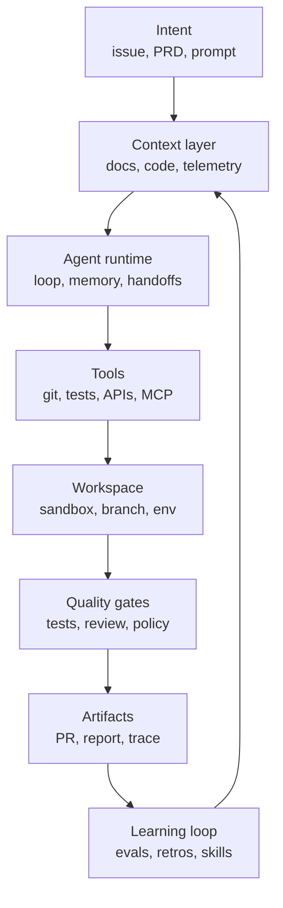
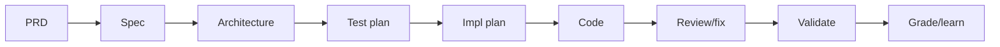
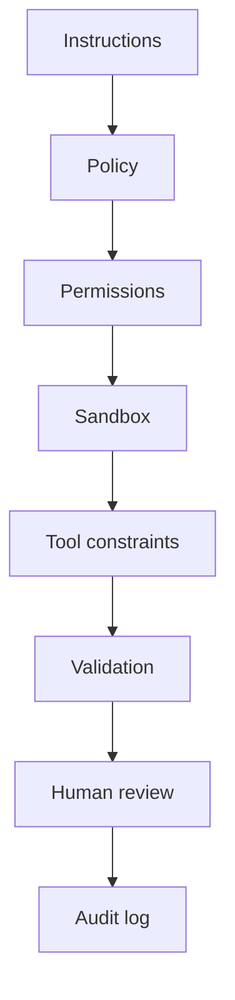
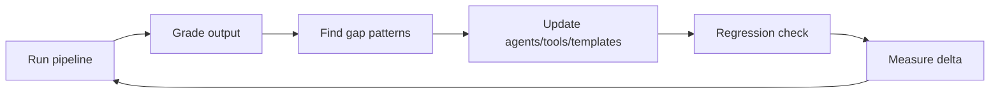

# Agentic Engineering

### Building software with agents, not just prompts

40 minutes

Note:
Opening framing: this is not a "how to prompt better" talk.
It is about how software engineering changes when AI systems can plan,
use tools, edit code, run tests, and keep working across multiple steps.

---

## The claim

**Agentic engineering is the discipline of designing the system around the agent.**

Not:

- "let the model do whatever"
- "vibe until it works"
- "replace engineers with bots"

But:

- goals
- context
- tools
- guardrails
- verification
- handoffs
- learning loops

Note:
This is the thesis. Keep it crisp. The engineer's leverage moves from
typing every implementation detail to designing the workflow where an agent can
make progress safely and observably.

---

## Why this matters now

Coding agents can already:

- inspect repositories and docs
- edit multiple files
- run builds and tests
- open branches and pull requests
- use issue trackers, browsers, telemetry, and MCP servers
- continue work in local, IDE, CLI, and cloud environments

The bottleneck is shifting from **model capability** to **engineering discipline**.

The 2026 pattern is clear: agents are becoming workers, MCP is the tool/context
connector, A2A is emerging for agent-to-agent interoperability, and reliable
systems emphasize context, verification, traces, and sandboxes over agent swarms.

Note:
Reference the public product trend without turning this into vendor marketing:
Claude Code, Copilot coding agent, Codex CLI/Web, Cursor-style agent modes,
OpenAI Agents SDK, LangGraph, AutoGen, CrewAI, smolagents, MCP, and A2A.

---

## The new failure mode

When a normal script fails, it usually fails where you wrote it.

When an agent fails, it may fail because:

- it had the wrong context
- the tool interface was ambiguous
- it optimized the wrong success criterion
- it silently skipped verification
- one worker made a decision another worker never saw
- the human approved a plausible artifact, not a proven result

Note:
This slide motivates why "just use agents" is not enough. The hard part is
operationalizing them.

---

## From assistant to agent

AI-assisted coding:

```text
human writes code
AI suggests snippets
human accepts / edits / rejects
```

Agentic coding:

```text
human defines intent
agent explores, plans, edits, validates
human reviews decisions and evidence
```

The output is not just code.

It is a **trace of decisions**.

Working definitions:

```text
workflow = fixed path of model/tool steps
agent    = model dynamically chooses steps and tools
runtime  = state, tools, permissions, traces, execution
```

Most production systems are hybrids.

Note:
This merges the old "Before" and "Now" slides. Emphasize trace: a trustworthy
agentic workflow creates artifacts you can audit: plan, changed files, test output,
review comments, telemetry checks.

---

## Vibe coding vs agentic engineering

| | Vibe coding | Agentic engineering |
| --- | --- | --- |
| Input | prompt | spec + constraints |
| Context | ad hoc | engineered |
| Validation | "looks right" | tests, reviews, telemetry |
| Memory | chat history | artifacts and traces |
| Failure handling | reprompt | diagnose loop |
| Human role | accept output | own decisions |

Note:
Do not dunk on vibe coding too much. It is great for prototypes. The point is
that production engineering needs stronger machinery.

---

## The 2026 reality check

Agents are good at:

- bounded coding tasks
- repo exploration
- test-driven bug fixes
- mechanical refactors
- docs and migrations
- review passes with clear criteria

Agents still struggle with:

- vague product judgment
- hidden business context
- long-horizon consistency
- cross-system side effects
- ambiguous ownership

Note:
This replaces the longer market-convergence and reality-check pair. Agents are a
strong engineering multiplier, not an excuse to stop engineering.

---

## Context engineering

Prompt engineering:

```text
How do I phrase this request?
```

Context engineering:

```text
What does the agent need to know, when, in what form,
with what tools, and with what feedback?
```

The prompt is just one packet in a larger system.

Note:
This is one of the most important conceptual shifts. Make it memorable.

---

## The context contract

For every serious agent task, define:

```text
goal:
  what outcome matters?
constraints:
  what must not change?
grounding:
  what sources are authoritative?
done:
  what evidence proves completion?
escalation:
  when should the agent stop and ask?
```

Note:
This is a reusable pattern. It can live in issue templates, agent instructions,
skills, or custom agent profiles.

---

## Good context has structure

Prefer artifacts over chat sludge:

| Need | Better artifact |
| --- | --- |
| product intent | PRD / issue brief |
| technical target | spec |
| architecture | design doc / diagram |
| implementation | file-level plan |
| validation | test matrix |
| learning | retrospective / rubric |

Also preserve provenance:

```text
requirement != codebase fact != assumption != model opinion
```

Note:
This merges structure and provenance. The point is that the agent should consume
explicit artifacts and distinguish different kinds of truth.

---

## Context anti-patterns

- giant instruction files nobody curates
- dumping entire repositories into context
- stale architecture notes
- vague "follow best practices" rules
- hidden requirements in human memory
- asking multiple workers to decide independently
- losing the reason behind a change

As context fills, quality often drops.

So ask: **what context earns its place?**

Note:
The "giant instruction file" warning is practical. Claude and Copilot docs both
push toward concise persistent instructions plus skills/custom agents for repeatable
workflows.

---

## The agentic engineering stack



Note:
This diagram is the backbone of the talk. You can refer back to it during the rest.

---

## Layer: intent

Weak intent:

```text
make onboarding better
```

Strong intent:

```text
reduce failed first-run setup for Windows users by detecting
missing Git earlier, showing the exact install command, and
covering this with CLI integration tests
```

Agents do not remove the need for product clarity.

They punish the lack of it faster.

Note:
Use a concrete example. Agents can implement, but the definition of value still
comes from humans.

---

## Layer: tools and protocols

A model sees tools through their interface.

Good tools are:

- small
- typed
- well documented
- hard to misuse
- explicit about side effects
- noisy when they fail

Two standards matter right now:

```text
MCP = agent -> tool/context
A2A = agent -> agent
```

Note:
This merges tool design, MCP, and A2A into one slide. MCP is widely adopted across
clients and servers. A2A is newer and focused on interoperability between opaque
agentic applications.

---

## Layer: workspace and runtime

Agents need room to act.

They also need boundaries:

- branch or worktree isolation
- sandboxed filesystem
- controlled network access
- scoped credentials
- reproducible dependencies
- clear cleanup rules

The runtime answers:

- who owns the loop?
- where does state live?
- where is the trace?
- where do humans approve?

Note:
This merges workspace and runtime. Tie it to cloud agents using ephemeral environments,
local CLI permission modes, Docker/sandbox patterns, and durable execution.

---

## Start simple

The best public guidance is surprisingly consistent:

> Use the simplest system that meets the reliability target.

Often that means:

1. one strong model call
2. retrieval or examples
3. tool use
4. fixed workflow
5. agent loop
6. multi-agent system

In that order.

Note:
Anthropic's "Building effective agents" says not to add complexity until it
demonstrably improves outcomes. This is a practical architecture principle.

---

## Workflow patterns that work

```text
prompt chain:
  draft -> gate -> expand -> finalize

routing:
  classify -> bug path | feature path | docs path

evaluator-optimizer:
  implement -> test -> review -> fix -> test
```

Use workflows when:

- steps are known
- quality criteria are clear
- intermediate checks improve output
- routing can be tested

Note:
This compresses three pattern slides. Workflows are underrated; not every reliable
system needs full autonomy.

---

## The pipeline pattern



This is agentic engineering at team scale:

- each stage creates an artifact
- each artifact has a gate
- humans own decisions
- learnings update the system

Note:
This is where the private inspiration is abstracted: a multi-stage pipeline from
idea to shipped code with quality gates and self-improvement.

---

## Where multi-agent goes wrong

```text
Task
  -> Agent A makes assumption X
  -> Agent B makes assumption not-X
  -> Agent C tries to merge both
```

The bug is not "the models are dumb."

The bug is **distributed unshared context**.

Safer uses:

- independent research
- bounded specialist tasks
- review from different perspectives
- generating options

Note:
This merges the "where it goes wrong" and "safer rules" slides. Parallelism is
valuable, but coordination costs are real. Actions carry implicit decisions.

---

## Give the agent a verifier

Weak:

```text
fix the bug
```

Strong:

```text
write a failing test that reproduces the bug,
fix the root cause, run the targeted test,
then run the package test suite
```

Agents get much better when they can check their own work.

Note:
Public Claude Code best practices explicitly recommend giving agents verification
criteria: tests, screenshots, builds, commands, etc.

---

## Quality gates

Useful gates:

- spec completeness
- architecture / threat review
- test coverage matrix
- lint/typecheck/build
- code review
- security scan
- rollout metrics
- retrospective score

The gate should block or escalate.

A gate that only produces vibes is decoration.

Note:
Make sure "gate" means decision, not just an artifact.

---

## Human-in-the-loop is not one thing

| Mode | Human does |
| --- | --- |
| approve | yes/no checkpoint |
| choose | select among options |
| edit | modify artifact |
| inspect | review trace/evidence |
| intervene | redirect live run |
| own | make product/security decision |

Good systems are explicit about which mode applies.

Note:
This avoids the vague phrase "human in the loop". A human rubber-stamping a giant
diff is not meaningful oversight.

---

## Safety is layered



Instructions are not enough.

Put guardrails outside the model too.

Note:
This aligns with sandboxing, permission allowlists, MCP server scopes, branch
isolation, and deterministic hooks.

---

## Observability for agents

You need a trace of:

- inputs read
- decisions made
- tools called
- failures, retries, and cost
- human interventions
- shipped outputs and metrics

No trace, no trust.

Note:
Frame traces as both debugging and governance: agentic systems need run logs like
distributed systems need logs.

---

## Evals: the missing CI job

Traditional CI asks:

```text
does this code still work?
```

Agent evals ask:

```text
does this agent workflow still produce good work?
```

Score runs on:

- accuracy
- completeness
- evidence
- maintainability
- acceleration
- safety

Track outcomes:

- cycle time to reviewed PR
- defect rate after merge
- review iterations
- human interruption rate
- cost per accepted change
- tasks with reproducible evidence

Then fix the pipeline, not just the one output.

Note:
This merges evals and the grading rubric. Use SWE-bench as a public example of
evaluating an agent system, not only a model. Internal evals can be much smaller
and domain-specific.

---

## The self-improvement loop



Common gap patterns:

- fabricated paths
- missing tests
- scope drift
- shallow review
- stale docs
- ungrounded assumptions

Note:
Emphasize system learning. Teams should treat agent instructions and skills as
production assets, not prompt scraps.

---

## Start with the right tasks

Good first tasks:

- documentation updates
- test generation for known behavior
- small bug fixes with repro steps
- mechanical migrations
- dependency update PRs
- codebase explanation
- issue triage
- review checklists

Bad first tasks:

- ambiguous product strategy
- risky auth changes
- broad rewrites
- multi-repo releases
- compliance-sensitive automation

Note:
Agentic engineering maturity starts with task selection.

---

## Intake, skills, and custom agents

Task intake should include:

```yaml
goal: ...
non_goals: ...
authoritative_sources: [...]
constraints: [...]
validation: [...]
human_checkpoints: [...]
```

Use:

- persistent instructions for repo commands, style rules, and gotchas
- skills for repeatable procedures, templates, scripts, and examples
- custom agents for narrow roles with explicit tools and escalation rules

Note:
This combines three adoption slides. Specificity beats persona inflation, and
skills beat giant memories because they load the right knowledge at the right time.

---

## The engineer's new job

Less time:

- typing boilerplate
- searching by hand
- making routine edits
- writing first drafts

More time:

- defining intent
- designing context
- shaping tools
- setting gates
- reviewing evidence
- making trade-offs
- improving the system

Note:
Engineering judgment becomes more important, not less.

---

## Team operating model

Treat agents like junior teammates with superpowers:

- onboard them with concise docs
- give them scoped tasks
- require evidence
- review their work
- improve their environment
- do not let them silently own product decisions

The difference:

They can run 20 times a day.

So your process flaws scale too.

Note:
Good line: agents scale both good process and bad process.

---

## What not to outsource

Keep humans accountable for:

- product strategy
- user empathy
- security posture
- architecture trade-offs
- irreversible operations
- legal/compliance decisions
- incident command
- final ownership of shipped code

Agents can provide options and evidence.

They should not become the accountability sink.

Note:
This is important for audience trust.

---

## The core lesson

Agentic engineering is not about trusting agents more.

It is about building systems where agents can be useful **without requiring blind trust**.

That means:

1. context engineering is the main leverage point
2. workflows beat autonomy until autonomy is needed
3. multi-agent systems need shared decisions
4. verification is the difference between demo and production
5. the best teams improve the pipeline, not just the prompt

Note:
This merges the core lesson and takeaways. Pause after the trust line, then close
with the numbered list.

---

## Sources and Q&A

Further reading:

- Anthropic: Building Effective Agents; Claude Code Best Practices
- OpenAI Agents SDK; Practical Guide to Building Agents
- GitHub Docs: Copilot coding agent, custom agents, and agent skills
- Model Context Protocol; Agent2Agent Protocol
- LangGraph, AutoGen, CrewAI, smolagents
- Cognition: Principles of Context Engineering
- SWE-bench / SWE-bench Verified

# What would you let an agent ship?

Note:
These are public sources used to calibrate the talk. The talk intentionally avoids
referencing private systems directly. Use the Q&A prompt to ask the audience to
think about a task they would delegate tomorrow and what evidence they would require.
